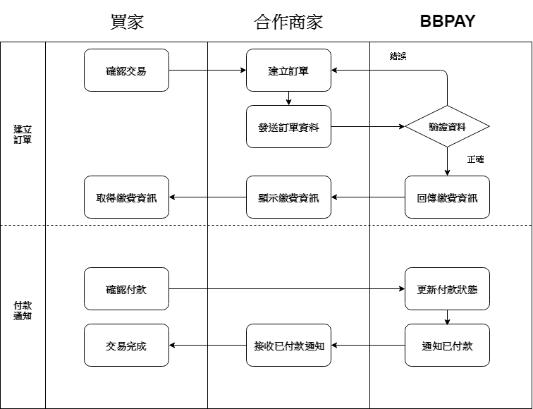

# BBPAY API 串接規格說明文件 

# 1. 交易流程



# 2. 準備工作

|參數|測試|正式|
|:--|:--|:--|
|商家編號(merchant_id)|9b39a23316ab3c27651b84429ac0bf06|由BBPAY另行提供|
|加密金鑰(hash_key)|52ee57cc13879998b7836f941cbf68ef|由BBPAY另行提供|
|接口路徑(API URL)|由BBPAY另行提供|由BBPAY另行提供|

# 3. 產生訂單

## 接口路徑

https://{domin}/pay/apiv1

## 參數說明

|參數名稱|必要參數|參數格式|參數說明
|:--|:--|:--|:--|
|merchant_id|是|String|由BBPAY所提供之商家編號
|vendor_uid|是|String|由商家所提供之不重複訂單編號，英數混和，上限20字
|type_id|是|Integer|交易類型(1：ATM 2：超商 3：信用卡)
|name|是|String|商品名稱
|total|是|Integer|訂單金額，須為大於零之整數
|notice|否|String|付款完成通知回傳網址
|hash|是|String|檢查碼，計算機制詳見<a href = "#appendix">附錄<a>

## 回傳參數說明

- 回傳格式為JSON

|參數名稱|參數格式|參數說明
|:--|:--|:--
|code|Integer|回傳狀態(0：成功 1：失敗)
|data|JSON Objects|回傳資料(成功時回傳)，參數包含繳費頁面(html)及繳費代碼(code)
|text|String|失敗訊息(失敗時回傳)

# 4. 付款結果通知

## 通知參數說明

|參數名稱|參數格式|參數說明
|:--|:--|:--
|code|Integer|通知狀態(0：成功)
|data|JSON Objects|回傳資料，參數包含商家所提供之訂單編號(vendor_uid)及訂單金額(total)

# <p id = "appendix">5.附錄<p>

## 檢查碼計算機制

(1) 將hash_key(由BBPAY提供，僅計算時使用)加入計算參數

(2) 將參數依照主鍵排序(由小到大)，並將主鍵與值以"="串聯，再使用"&"將所有參數串聯成字串
```
hash_key=52ee57cc13879998b7836f941cbf68ef&merchant_id=9b39a23316ab3c27651b84429ac0bf06&name=api test&notice=https://{your url}&total=900&type_id=3&vendor_uid=00000000000000000001
```
(3) 將字串透過MD5雜湊
```
1d994bd8cb7f963447146c92b16d0bd2
```